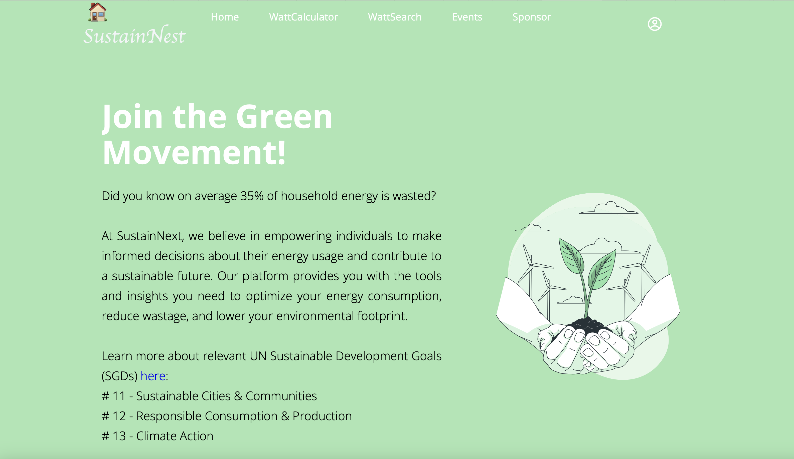
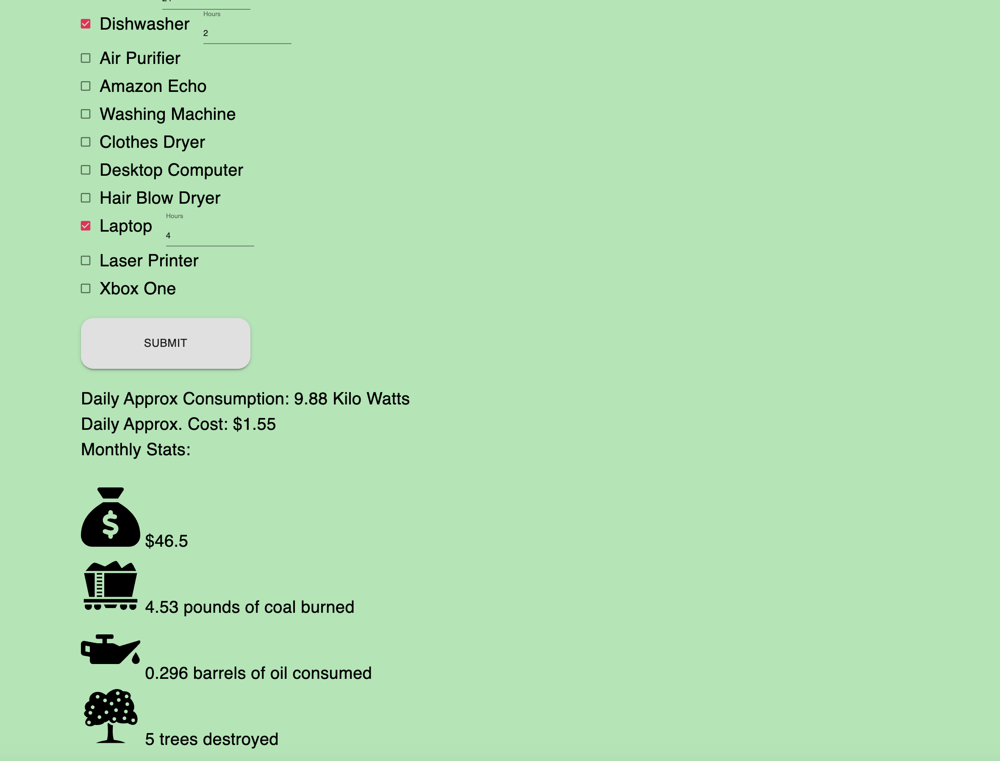
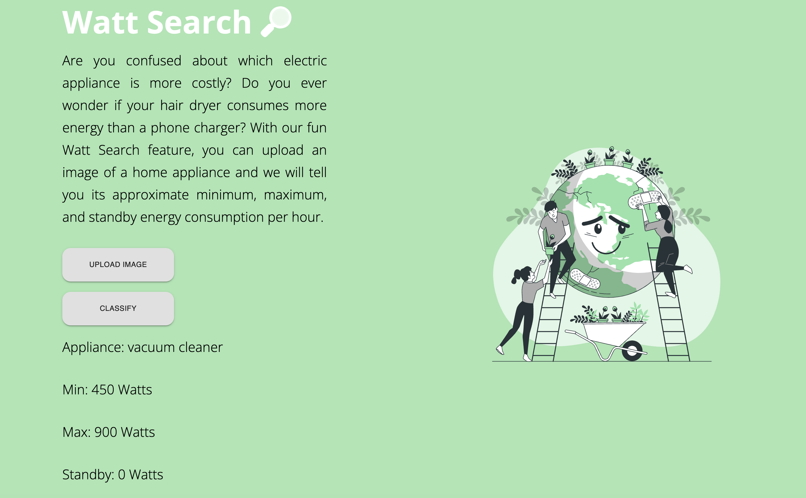
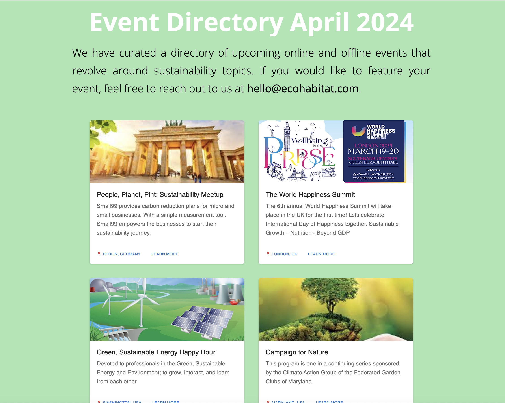
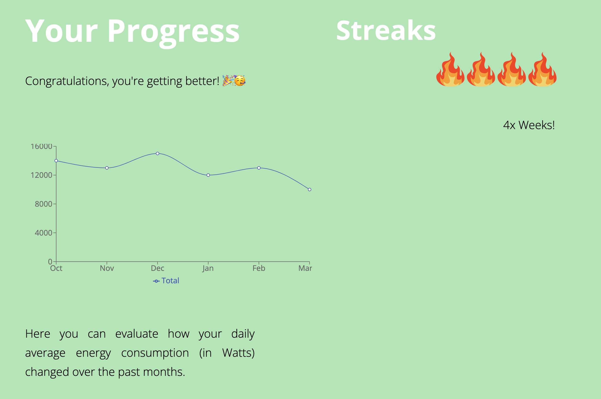

-- High School Category -- 

Hi, I am Zoya, a high school student from Abidjan, Ivory Coast. I'm currently doing my IB program from the International Community School of Abidjan.

Theme: Sustainability 

# SustainNest 

For this hackathon, I am proposing an educational platform called SustainNest. This aims to encourage individuals to learn more about the energy consumption of different household appliances and then make mindful decisions. The fun elements added in this application will motivate the younger generation to use it. This project aims to contribute towards the following Sustainable Development Goals (SDGs):

* SDG 11: Sustainable Cities and Communities
* SDG 12: Responsible Consumption and Production
* SDG 13: Climate Action



Overall, this could promote environmental well-being, help reduce waste, and conserve resources (i.e household energy).

# The Problem

The world’s energy consumption is on an upward trajectory, with global demand growing by approximately 1% to 2% each year. Households are significant contributors to this surge, with residential energy use accounting for a notable share of global energy consumption. The challenge we face is not just in the quantity of energy used but also in the efficiency of its use.

Statistics: The average household’s energy expenditure is substantial, and a staggering 35% of this energy is wasted, often through inefficient appliances and lack of energy-saving practices.

Cost: This inefficiency isn’t just about energy; it’s a financial strain too. The typical U.S. household spends around $1,368 on energy annually, with idle devices alone contributing up to $165 to this figure.


# Feature: WattCalculator

This is a fun feature where users can estimate their daily household energy consumption by filling out the given form. They can check mark the used appliances and specify the number of hours they were used for.

Then, they will get a rough estimate for their daily energy consumption along with some thought provoking stats for example monthly costs as well as resources used to create this amount of energy like pounds of coal burnt or number of trees destroyed etc.



# Feature: WattSearch

With our fun Watt Search feature, you can upload an image of a home appliance and we will tell you its approximate minimum, maximum, and standby energy consumption per hour. There might be appliances that are not detected yet but we will keep working on improving our data collection.



# Feature: Event Directory

This is a curated list of global events where young minds can learn more about sustainability. 



# Feature: User Profile

Users can evaluate how their daily average energy consumption (in Watts) changed over the past months. We can also have a gamification aspect such that users can build up streaks if they regularly use the app. This can encourage them to use it more often.

I know users can just Google the energy consumption but the aim is to add an engaging aspect, especially for the younger generation.



## Technologies 

* React js
* Next js
* HTML/CSS

React libraries such as:

* recharts
* Material UI
* react-icons
* ml5.js

* Landing Image: StorySet

**Image Classification:**

For the WattSearch feature, I utilized ml5.js's ImageClassifier. ML5 is a library that allows users to play around with machine learning models within their browsers. In older days, we might have needed a high computational computer in order to run machine learning models. However, with ml5, we can just run models in our browser without having to worry about computing power. In this case, I have used the pre-trained model MobileNet. 

You can read more here: 

https://learn.ml5js.org/#/reference/image-classifier

https://arxiv.org/abs/1704.04861

After obtaining the predicted results from the ImageClassifier, I then cross checked them with my saved data to see if I have any info regarding that object's energy consumption. If yes, I displayed it to the user.

## Challenges Faced

* React + Next: I have only worked with React once before so putting everything together was quite some challenge but luckily there are a lot of resources online 🙈. There were also a lot of Next Rendering/window issues so a lot of time was consumed by debugging.

* Setting up ml5: Initially, I tried the image classification with a stand-alone html/js page. This worked after some hit and trial but the real challenge was integrating this within a React app for a better looking UI. 

* Finding data: I couldn't find a lot of interesting datasets for household energy consumption which I could have used for implementing any machine learning models (for example for predictions).

* MobileNet's limitations: The pre-trained model wasn't able to identify all potential household applications. Especially if there are other objects within the picture frame as well.

* React Hooks were also new to me.

## What I learnt: 

Overcoming challenges described above. Since I haven't worked with React much before, I went through different open source projects to take inspiration on how to structure my code/components/pages etc.

## Future Steps:

* Improving data: Adding info about more household applications
* Custom Image Classification Model: We can use Google's Teachable Machine to train our own model with various different household applications but that would require huge datasets.
* User Login/Signup page
* A backend / database where all the energy consumption and user data (for example last month's statistics) is stored


## Local Setup

**NPM Installation**

https://radixweb.com/blog/installing-npm-and-nodejs-on-windows-and-mac
```
npm install next@latest react@latest react-dom@latest
npm install @mui/material @emotion/react @emotion/styled
```
**Run the project**

Run:
```
npm run dev
```

Open ```http://localhost:3000/``` in your browser.

# Try it Out

https://sustainnest.netlify.app/

## Test Images

You can test the WattSearch feature with the images here ```public/images/wattsearch```
